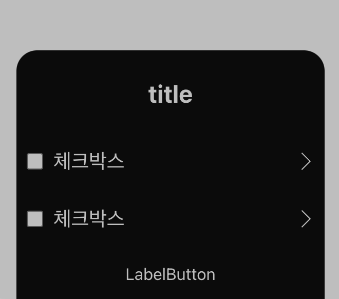

```javascript
function App() {
  return (
    <div >
        <Dialog isOpen>
          <Dialog.Title>title</Dialog.Title>
          <Dialog.CheckBox>체크박스</Dialog.CheckBox>
          <Dialog.CheckBox>체크박스</Dialog.CheckBox>
          <Dialog.LabelButton>LabelButton</Dialog.LabelButton>
        </Dialog>
    </div>
  );
}

export default App;
```

``` javascript
import DialogMain from './DialogMain';
import DialogTitle from './DialogTitle';
import DialogLabelButton from './DialogLabelButton';
import DialogCheckBox from './DialogCheckBox';

export const Dialog = Object.assign(DialogMain, {
  Title: DialogTitle,
  CheckBox: DialogCheckBox,
  LabelButton: DialogLabelButton,
});
```


```javascript

const DialogMain = ({ isOpen, children }) => {
  if (!isOpen) {
    return null;
  }

  const dialogTitles = getDialogTitles(children);
  const dialogLabelButtons = getDialogLabelButtons(children);
  const otherChildren = getOtherChildren(children);

  return createPortal(
    <Wrapper>

      <div>
        {dialogTitles && <div>{dialogTitles}</div>}
        {/*{dialogCheckBoxes && <div>{dialogCheckBoxes}</div>}*/}
        {otherChildren}
        {dialogLabelButtons && (
          <div>
            {dialogLabelButtons}
          </div>
        )}
      </div>
    </Wrapper>,
    document.body);
};

export default DialogMain;
```